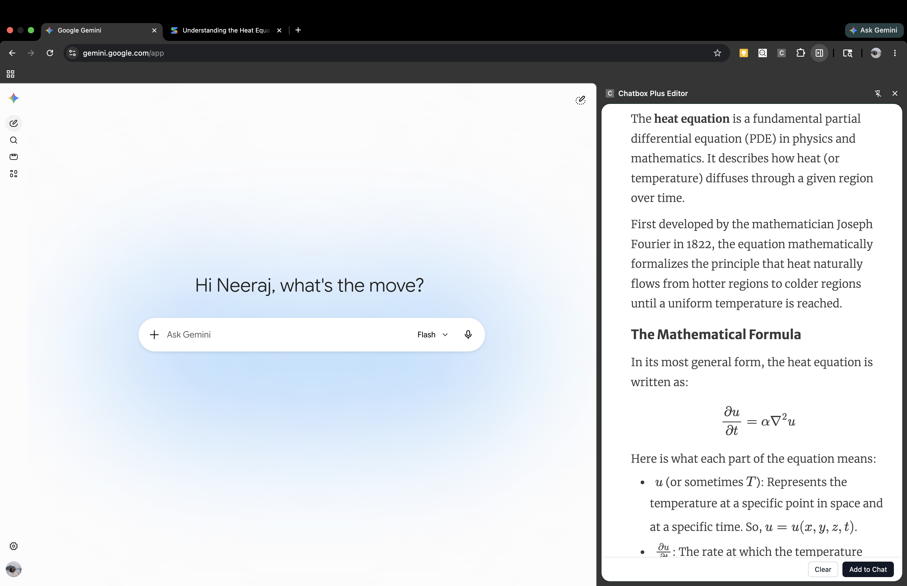

# Chatbox Plus



## Description
Chatbox Plus is a modern Chrome extension featuring a Lexical-based rich text editor in a convenient side panel. It allows you to compose and format your text effectively, and seamlessly export your markdown directly into supported LLM chat interfaces (Google AI Studio and Google Gemini) with a single click of the "Add to Chat" button. You also have an option to change font sizes—you can pick small, medium, or large (default is medium).

## Installation

1. Clone or download this repository.
2. Install the project dependencies by running:
   ```bash
   npm install
   ```
3. Build the extension for production:
   ```bash
   npm run build
   ```
4. Open Google Chrome and navigate to `chrome://extensions`.
5. Enable **Developer mode** in the top right corner.
6. Click on **Load unpacked** in the top left corner.
7. Select the `dist` folder that was generated in the project directory.
8. Click on the extension icon in Chrome to open the side panel and start composing!
